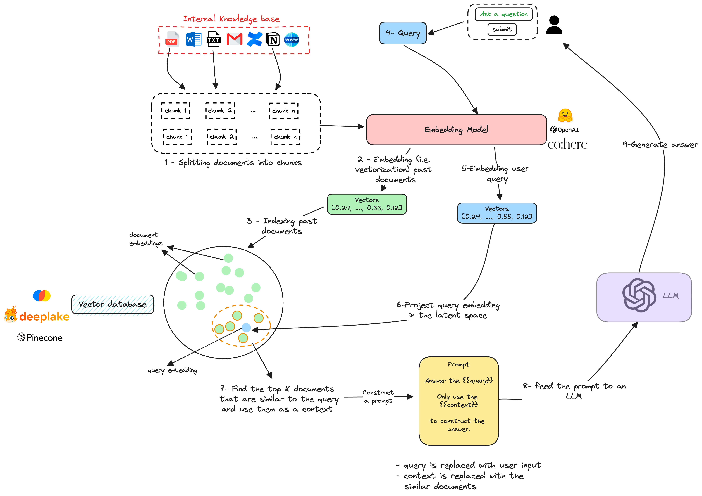
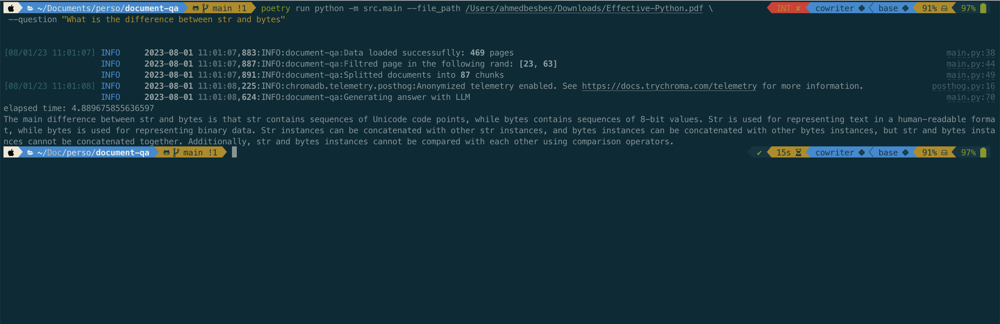

# document-qa


This a little experiment with Langchain and Chroma to build a document question answering system over a PDF file.


### Architecture

The architecture behind this system is detailed in the following diagram



### Setup

1. Install Poetry

2. Clone the repo

3. Run: `poetry install --with dev`

4. Create a `.env` file at the root of the project with your open AI key

```
OPENAI_API_KEY=<YOUR_API_KEY_GOES_HERE>
```

### Demo

You can run the script with the following commands

```bash
poetry run python -m src.main --file_path /Users/ahmedbesbes/Downloads/Effective-Python.pdf \   
                              --question "What is the difference between str and bytes"
```


